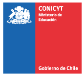
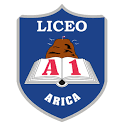
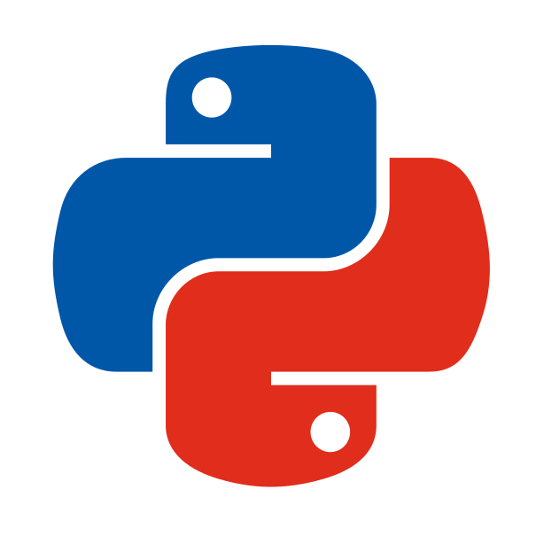
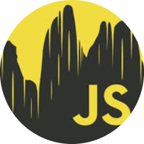

## More

  

  <h3 style="color: white; margin-top: 0;">Honors & Awards</h3>

  

&nbsp <strong>  CONICYT </strong>  
&nbsp Santiago, 2017  

National Master's Scholarship

&nbsp <strong>  UTFSM </strong>  
&nbsp Valparaiso, 2011 - 2016  

Award: Best student (Class of 2011), Award: Best student (Statistic Area), 
Honors: Honor Roll, Scholarship: Academic Excellence

&nbsp <strong> SOMACHI</strong>  
&nbsp Santiago, 2010  

Bronze Medal (National Math Olympiad)

&nbsp <strong> SOCHIFI </strong>  
&nbsp Santiago, 2010  

Participation (National Physics Olympiad)

&nbsp <strong> Liceo Octavio Palma Perez</strong>  
&nbsp Arica, 2010   

Award: Best Scientist

  

  

  <h3 style="color: white; margin-top: 0;">Volunteering</h3>

&nbsp <strong> Coordination</strong>  
&nbsp Python Chile  
&nbsp 2022 - 2026

&nbsp <strong> Coordination</strong>  
&nbsp Techschool Latam 
&nbsp 2025 - 2026 

&nbsp <strong> Speaker</strong>  
&nbsp Java Script Chile  
&nbsp 2024 

&nbsp <strong> Coordination</strong>  
&nbsp Python Chile  
&nbsp 2022 

&nbsp <strong> Partner</strong>  
&nbsp SOMACHI  
&nbsp 2022

  

