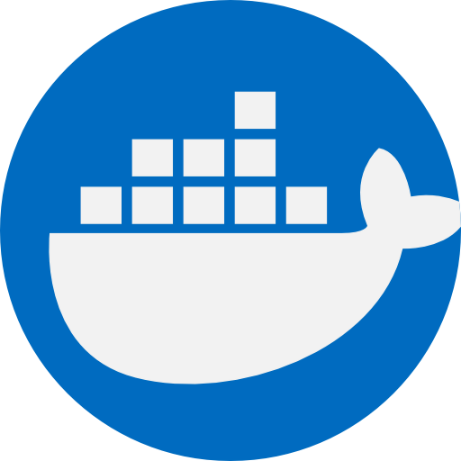
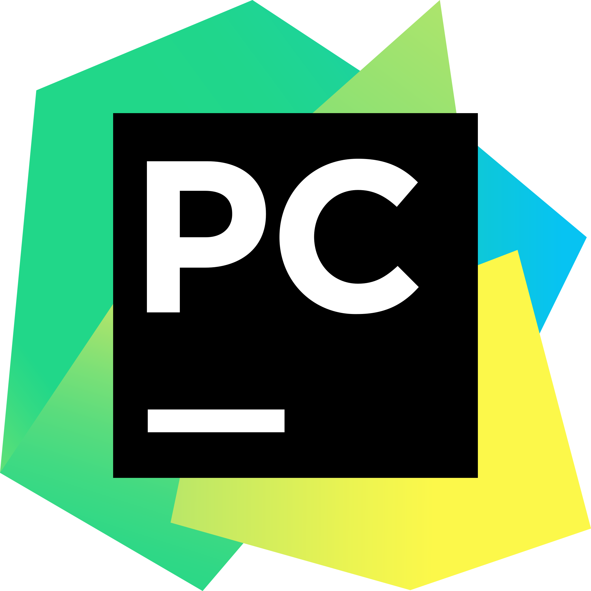

### Education

  
  
    &nbsp;<strong>Master’s Degree </strong> 
    &nbsp;Master in Sciences 
    &nbsp;UTFSM - 2019
  

  
  
    &nbsp;<strong>Bachelor’s Degree</strong> 
    &nbsp;Mathematical Engineering 
    &nbsp;UTFSM - 2017
  

 
**Extras**

  
  
    &nbsp;<strong>Certification  </strong> 
    &nbsp;University Teaching 
    &nbsp;UTFSM - 2024
  

 

### Certifications

  
  
    &nbsp;<strong>Microsoft</strong> 
    &nbsp;Online Certifications
  

* Microsoft Certified: Azure Fundamentals
* Microsoft Certified: Azure Data Engineer Associate
 Microsoft.

  
  
    &nbsp;<strong>DeepLearning.AI </strong> 
    &nbsp;Online Certifications
  

* TensorFlow Developer
* Deep Learning
* Machine Learning
* **Short Courses**: 
    * Building and Evaluating Advanced RAG
    * ChatGPT Prompt Engineering for Developers
    * Functions, Tools and Agents with LangChain
    * LangChain Chat with Your Data
    * LangChain for LLM Application Development
    * Attention in Transformers: Concepts and Code in PyTorch
    * Building Systems with the ChatGPT API
    * Building toward Computer Use with Anthropic
    * Event-Driven Agentic Document Workflows
    * How Transformer LLMs Work
    * Multi AI Agent Systems with crewAI

  
  
    &nbsp;<strong>Coursera</strong> 
    &nbsp;Online Certifications
  

* DevOps on AWS
* Machine Learning
* Preparing for Google Cloud Certification: Machine Learning Engineer
* Microsoft Azure Machine Learning for Data Scientists
* How to Manage a Remote Team
* University Teaching

  
  
    &nbsp;<strong>Udemy</strong> 
    &nbsp;Online Certifications
  

* Docker Mastery: with Kubernetes + Swarm from a Docker Captain
* Taming Big Data with Apache Spark and Python - Hands On!

  
  
    &nbsp;<strong>Gitlab</strong> 
    &nbsp;Online Certifications
  

* Gitlab 101
* Gitlab 201

  
  
    &nbsp;<strong>Databricks</strong> 
    &nbsp;Online Certifications
  

* Generative AI Fundamentals
* Lakehouse Fundamentals

 

### Stack

#### Languages & Frameworks

 
&nbsp;
&nbsp;

 
&nbsp;
&nbsp;&nbsp;

#### Cloud

&nbsp;
&nbsp;

#### Tools and Others

 
&nbsp;
&nbsp;