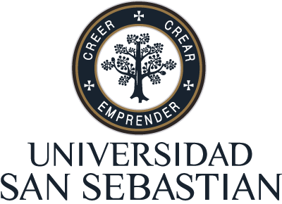

## Experience

### Work Experience

&nbsp <strong> Head of Advanced Analytics</strong>  
&nbsp  Grupo Security   
&nbsp 2023 – Present

Lead the development and implementation of algorithms (Tech Department):

* Prospects: Strategies and customer acquisition in life insurance.
* Analyzed former clients to improve retention in life insurance.
* Successful implementation of a life insurance fraud detection model.
* Managed efficient handling of redemptions and transfers of Mutual Funds.
* Contributed to the formulation and development of policies related to Artificial Intelligence
(AI).
 

&nbsp <strong> Senior Data Scientist</strong>  
&nbsp  Walmart Chile   
&nbsp 2021 – 2023

Design and implementation of several machine learning algorithms within the
Walmart Commercial Department:

* Demand estimation forecasts for supermarkets.
* Analysis and recommendation of products on promotion.
* Lead career development plan for different Data Science profiles.
 

&nbsp <strong> Senior Data Scientist</strong>  
&nbsp  Banco Itaú  
&nbsp 2020 – 2021

Design and implementation of several machine learning algorithms within the
Analytics Department:

* Implementation of the winning solution of the Data Science Challenge (Itau
Bank).
* Risk Score Modelling (ITAU and Rappi alliance project).
* Lead career development plan for different Data Science profiles.
 

&nbsp <strong> Data Scientist</strong>  
&nbsp   Cencosud S.A.  
&nbsp 2019 - 2020

Design and implementation of several machine learning algorithms within the
Cencosud’s Advanced Analytics Department:

* Demand estimation forecasts for supermarkets and home improvement stores.
* Optimization modelling to find the best assignments of shifts of store workers
taking into account several features like demand forecast, labour-legal constraints
and each worker availability.
* Models of Storage Assignment with congestion to improve picker travel times
within the distribution centers.
 

 

&nbsp <strong> Data Scientist</strong>  
&nbsp  U-Planner  
&nbsp 2018 – 2019

Main developer of all the algorithms with a strong analytical foundation of the
company:

* Diagnostic of the academic programming.
* Allocation of university infrastructure.
* Analysis university programs (Latin America).
 

 

&nbsp <strong> Data Scientist</strong>  
&nbsp  IConstruye  
&nbsp 2018 – 2019

Main developer of text classification algorithm over purchase orders (construction
area) applied techniques of Natural Language Processing.
 

 

&nbsp <strong> Researcher</strong>  
&nbsp PUCV  
&nbsp 2017 – 2018

Researcher in charge of the following projects:

* University retention about construction engineering students.
* Spatial-statistics study for 3D Kriging about laboratory tests for tailings.
 

 

&nbsp <strong> Data Scientist</strong>  
&nbsp  U-Planner  
&nbsp 2016 – 2017

**Internship**: Main developer of all the algorithms with a strong analytical foundation
of the company:

* Study plans design and optimization .
* University retention.
* Allocation of university infrastructure.

 

### Teaching Experience

&nbsp <strong> Universidad Técnica Federico Santa María (UTFSM)</strong>  
&nbsp Valparaiso, Chile.  
&nbsp 2012 - 2025

* **Co-Adviser**. Juan Briceño. Prediction and classification of course of a bank benefit.
* **Lecturer**. Algebra, Calculus, Programming, Statistics Projects, Applied Mathematics.
* **Support Teacher**. Design the material related to the exercises, quizzes and tests of the Algebra and Calculus courses.
* **Course Assistant**: Algebra, Calculus, Statistical Inference, Regression
Analysis, Time Series, Statistical Methods, Real Analysis.

&nbsp <strong> Universidad San Sebastián (USS)</strong>  
&nbsp Santiago, Chile.  
&nbsp 2025

* **Lecturer**. Statistics and Data Visualization.
* **Coordination**. Supporting in the organization (courses, website, events).

&nbsp <strong> Universidad Montevideo (UM)</strong>  
&nbsp Montevideo, Uruguay.  
&nbsp 2025

* **Co-Adviser**. Natalia Ripa, Felipe Renom, Verónica Suárez. Predictive model for estimating house prices in Montevideo.
* **Coordination**. Supporting in the organization (courses, website, events).

&nbsp <strong> DUOC UC</strong>  
&nbsp Santiago, Chile.  
&nbsp 2022-2023

* **Lecturer**. Deep Learning Introduction.
* **Specialist**. Committee tasked with planning, designing, and creating new study programs for Computer Science Department.

&nbsp <strong>TripleTen</strong>  
&nbsp Bootcamp, Online.  
&nbsp 2022-2023  

* **Tutor**. Data Science Teacher.

&nbsp <strong> Coding Dojo</strong>   
&nbsp Bootcamp, Online.  
&nbsp 2022-2023  

* **Instructor**. Data Science Teacher.
