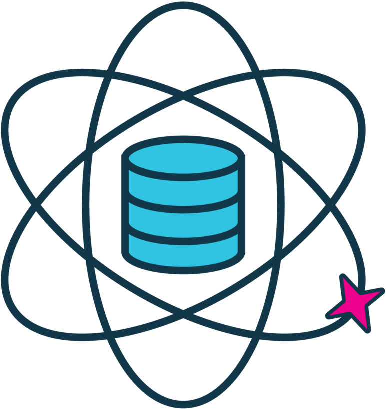

## Projects

  

     <h3 style="margin-top: 0;"><a href="https://github.com/fralfaro/Github-Intro" target="_blank" style="text-decoration: none; ">Data Science Cheat Sheets</h3>

  
  
     
      &nbsp;🐍 Python  
    &nbsp;🌐 R-Project 
    &nbsp;📅 Aug 20, 2023   
      
  

This repository serves as a hub for various Cheat Sheets related to 
the field of Data Science (with Python and R). What sets these Cheat Sheets apart is their 
multidimensional approach to enhancing the learning experience. 
Each Cheat Sheet is made available in three distinct formats: PDF, Streamlit, and Google Colab.   

This threefold approach to guarantee that learners can interact with the content in 
a manner that aligns with their preferences and learning style.   

<blockquote style="margin: 10px 0 0 0; padding-left: 15px; border-left: 4px solid #ccc; font-style: italic;">
        <strong>Note:</strong> You can find the repository at the following link: 
        <a href="https://github.com/fralfaro/DS-Cheat-Sheets" target="_blank">fralfaro/DS-Cheat-Sheets</a>.
      </blockquote>

  
  

     <h3 style="margin-top: 0;"><a href="https://github.com/fralfaro/Github-Intro" target="_blank" style="text-decoration: none; ">Cybersecurity and Data Protection Laws</h3>

  
  
      &nbsp;🐍 Python 
    &nbsp;🧪 Data Science  
    &nbsp;📅 Oct 01, 2024     
  

The goal of this project is to present, through an interactive Streamlit application, the key articles of the Cybersecurity Framework Law and the Personal Data Protection Law, along with clear summaries and practical exercises, so users can learn dynamically.    

<ul>
<li>You can access the interactive web application at the following link: <a href="https://leyes-datos-chile.streamlit.app/" target="_blank">App</a>.
</li>
<li>The project source code is available on the official repository: <a href="https://github.com/fralfaro/st_leyes" target="_blank">GitHub</a>.
</li>
</ul>

  <h3 style="margin-top: 0;"><a href="https://github.com/fralfaro/Github-Intro" target="_blank" style="text-decoration: none; ">Github Introduction</a></h3>
  

    

      
    

    

      
        📃 <strong>Markdown</strong> 
        🌐 <strong>Github</strong> 
        📅 <strong>May 03, 2024</strong>
      
    

    

      
This repository is designed to provide practical tutorials on various GitHub concepts, ranging from enhancing your GitHub Profile to utilizing GitHub Actions and GitHub Pages.

      
The primary goal is to offer hands-on learning experiences that empower users to become proficient in GitHub's features effectively.

    

  

  <h3 style="margin-top: 0;"><a href="https://fralfaro.github.io/online-cv/" target="_blank" style="text-decoration: none; ">Online CV</a></h3>
  

    

      
    

    

      
        🐍 <strong>Python</strong> 
        📃 <strong>Mkdocs</strong> 
        📅 <strong>Apr 25, 2024</strong>
      
    

    

      
Creating an online resume (CV) with Mkdocs and GitHub Actions offers a modern and efficient way to showcase your professional experience and skills.

      
Mkdocs, combined with GitHub Actions for automated deployment, provides a seamless workflow for maintaining and updating your online resume with ease.

    

  

  <h3 style="margin-top: 0;"><a href="https://gitlab.com/fralfaro/cv" target="_blank" style="text-decoration: none; ">Curriculum Vitae</a></h3>
  

    

      
    

    

      
        🦊 <strong>Gitlab</strong> 
        📃 <strong>Mkdocs</strong> 
        📅 <strong>Apr 15, 2024</strong>
      
    

    

      
A Continuous Integration Pipeline project to get nice curricula effortlessly. This project aims to:

      <ul style="padding-left: 20px;">
        <li>Version my CV and automatize updates.</li>
        <li>Master Gitlab CI/CD Pipelines and Continuous Integration.</li>
      </ul>
    

  

  <h3 style="margin-top: 0;"><a href="https://fralfaro.github.io/agency-website/" target="_blank" style="text-decoration: none; ">Personal Agency Website</a></h3>
  

    

      
    

    

      
        🧪 <strong>Jekyll</strong> 
        🌐 <strong>Github</strong> 
        📅 <strong>Apr 05, 2024</strong>
      
    

    

      
A Jekyll Agency Bootstrap theme for building stunning and functional websites for digital agencies or startups.

      
Combining Jekyll's flexibility with Bootstrap's modern design to create dynamic and responsive sites.

    

  

  <h3 style="margin-top: 0;"><a href="https://github.com/fralfaro/python_project" target="_blank" style="text-decoration: none; ">Data Science project</a></h3>
  

    

      
    

    

      
        🐍 <strong>Python</strong> 
        🤖 <strong>ML</strong> 
        📅 <strong>Feb 20, 2024</strong>
      
    

    

      
A comprehensive framework designed to streamline the process of executing data science projects.

      
Includes a meticulously structured template covering all phases, from data collection to model deployment.

    

  

  <h3 style="margin-top: 0;"><a href="https://fralfaro.github.io/Streamlit-Examples/" target="_blank" style="text-decoration: none; ">Streamlit Examples</a></h3>
  

    

      
    

    

      
        🐍 <strong>Python</strong> 
        ♛ <strong>Streamlit</strong> 
        📅 <strong>Aug 10, 2023</strong>
      
    

    

      
Interactive web applications made simple. Turn data analysis and visualizations into engaging web apps.

      <blockquote style="margin: 10px 0 0 0; padding-left: 15px; border-left: 4px solid #ccc; font-style: italic;">
        <strong>Note:</strong> Simplified adaptation of the official documentation in Spanish.
      </blockquote>
    

  

  <h3 style="margin-top: 0;"><a href="https://fralfaro.github.io/Vizzu-Examples/" target="_blank" style="text-decoration: none; ">Vizzu Examples</a></h3>
  

    

      
    

    

      
        🐍 <strong>Python</strong> 
        📶 <strong>Vizzu</strong> 
        📅 <strong>Aug 10, 2023</strong>
      
    

    

      
Free and open-source animated data visualization library. Designed to build animated data stories and interactive explorers.

      <blockquote style="margin: 10px 0 0 0; padding-left: 15px; border-left: 4px solid #ccc; font-style: italic;">
        <strong>Note:</strong> Simplified adaptation of the official documentation in Spanish.
      </blockquote>
    

  

  <h3 style="margin-top: 0;">
    <a href="https://gitlab.com/fralfaro/fastmatrix" target="_blank" style="text-decoration: none; ">
      Fastmatrix
    </a>
  </h3>

  

    

        

  
      
    

    

     

      

        <strong><em>Fast computation of some matrices useful in statistics</em></strong>
      

      
      

        Yet another R package for matrices. It contains a small set of functions to fast computation 
        of some matrices and operations useful in statistics.
      

      <blockquote style="margin: 15px 0 0 0; padding-left: 15px; border-left: 4px solid #ccc; font-style: italic;">
        <strong>Note:</strong> This repository is an alternative to 
        <a href="https://github.com/faosorios/fastmatrix" target="_blank">faosorios/fastmatrix</a>. 
        This repository is just a transformation of packages from R to Python.
      </blockquote>
    

